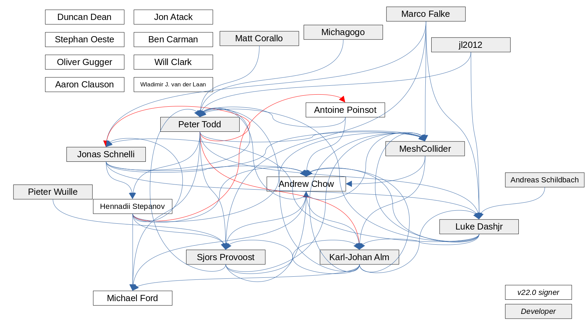

# How to get verified copies of the bitcoin developer keys

The core problem of gpg trust is trusting the keys against which we will verify the source code.
There are a few approaches to getting the keys:
1. Meeting the person in question and verifying 
2. Getting the keys from a trusted secondary source that has verified the keys in person
3. Using the web of trust model to get from a already trusted key to not yet trusted key
4. Blindly downloading the keys from keyservers and hoping for the best

Options 1 and 2 may for practical reasons not be obtainable and is certainly not automatable.

Here we will therefor the next best by starting with 4. and verifying the keys against additional sources, as many as we can find.
The rationale here being that it will be increasingly difficult for an attacker succeed for each additional source we can add.

## Bitcoin Core developer keys, an investigation

According to the hash signature file ([SHA256SUMS.asc](https://bitcoincore.org/bin/bitcoin-core-22.0/SHA256SUMS.asc)) 
bitcoind version 22.0 is signed by 13 of the developers.

This file does, however, not give us any information about which 13 keys created these signatures or, for our purposes 
more importantly which persons these keys belong to.

The Bitcoin Core Github repository contains the file `keys.txt`, the version of this file from git master contains the key 
fingerprints for 56 developers, the version as it appeared 

* Git master: [keys.txt](https://raw.githubusercontent.com/bitcoin/bitcoin/master/contrib/builder-keys/keys.txt)
* Version 22.0: [keys.txt](https://raw.githubusercontent.com/bitcoin/bitcoin/22.x/contrib/builder-keys/keys.txt)

The difference (as of this writing) is the addition of 5 names:

| Name           | Github username |
|----------------|-----------------|
| Carl Dong      | dongcarl        |
| Duncan Dean    | dunxen          |
| James O'Beirne | jamesob         |
| Kristaps Kaupe | kristapsk       |
| Will Clark     | will8clark      |

As we shall see, two of these had signed the 22.0 release so I will be using the version from git master in the future.
Important to note is that no keys had been changed or removed from the between the time of release and the time I checked out the git master version.

Downloading this file

    wget https://raw.githubusercontent.com/bitcoin/bitcoin/master/contrib/builder-keys/keys.txt

and inspecting it's content:

| Key fingerprint                            | Name                                      | Github username        |
|--------------------------------------------|-------------------------------------------|------------------------|
| `9D3CC86A72F8494342EA5FD10A41BDC3F4FAFF1C` | Aaron Clauson                             | sipsorcery             |
| `617C90010B3BD370B0AC7D424BB42E31C79111B8` | Akira Takizawa                            | akx20000               |
| `E944AE667CF960B1004BC32FCA662BE18B877A60` | Andreas Schildbach                        | aschildbach            |
| `152812300785C96444D3334D17565732E08E5E41` | Andrew Chow                               | achow101               |
| `590B7292695AFFA5B672CBB2E13FC145CD3F4304` | Antoine Poinsot                           | darosior               |
| `0AD83877C1F0CD1EE9BD660AD7CC770B81FD22A8` | Ben Carman                                | benthecarman           |
| `912FD3228387123DC97E0E57D5566241A0295FA9` | BtcDrak                                   | btcdrak                |
| `04017A2A6D9A0CCDC81D8EC296AB007F1A7ED999` | Carl Dong                                 | dongcarl               |
| `C519EBCF3B926298946783EFF6430754120EC2F4` | Christian Decker                          | cdecker                |
| `18AE2F798E0D239755DA4FD24B79F986CBDF8736` | Chun Kuan Le                              | ken2812221             |
| `101598DC823C1B5F9A6624ABA5E0907A0380E6C3` | CoinForensics                             | CoinForensics          |
| `F20F56EF6A067F70E8A5C99FFF95FAA971697405` | centaur                                   | centaur                |
| `C060A6635913D98A3587D7DB1C2491FFEB0EF770` | Cory Fields                               | cfields                |
| `BF6273FAEF7CC0BA1F562E50989F6B3048A116B5` | Dev Random                                | devrandom              |
| `6D3170C1DC2C6FD0AEEBCA6743811D1A26623924` | Douglas Roark                             | droark                 |
| `948444FCE03B05BA5AB0591EC37B1C1D44C786EE` | Duncan Dean                               | dunxen                 |
| `1C6621605EC50319C463D56C7F81D87985D61612` | Emanuele Cisbani                          | cisba                  |
| `9A1689B60D1B3CCE9262307A2F40A9BF167FBA47` | Erik Mossberg                             | erkmos                 |
| `D35176BE9264832E4ACA8986BF0792FBE95DC863` | fivepiece                                 | fivepiece              |
| `6F993B250557E7B016ADE5713BDCDA2D87A881D9` | Fuzzbawls                                 | Fuzzbawls              |
| `01CDF4627A3B88AAE4A571C87588242FBE38D3A8` | Gavin Andresen                            | gavinandresen          |
| `D1DBF2C4B96F2DEBF4C16654410108112E7EA81F` | Hennadii Stepanov                         | hebasto                |
| `A2FD494D0021AA9B4FA58F759102B7AE654A4A5A` | Ilyas Ridhuan                             | IlyasRidhuan           |
| `2688F5A9A4BE0F295E921E8A25F27A38A47AD566` | James O'Beirne                            | jamesob                |
| `D3F22A3A4C366C2DCB66D3722DA9C5A7FA81EA35` | Jarol Rodriguez                           | jarolrod               |
| `7480909378D544EA6B6DCEB7535B12980BB8A4D3` | Jeffri H Frontz                           | jhfrontz               |
| `D3CC177286005BB8FF673294C5242A1AB3936517` | jl2012                                    | jl2012                 |
| `82921A4B88FD454B7EB8CE3C796C4109063D4EAF` | Jon Atack                                 | jonatack               |
| `32EE5C4C3FA15CCADB46ABE529D4BCB6416F53EC` | Jonas Schnelli                            | jonasschnelli          |
| `4B4E840451149DD7FB0D633477DFAB5C3108B9A8` | Jorge Timon                               | jtimon                 |
| `C42AFF7C61B3E44A1454CD3557AF762DB3353322` | Karl-Johan Alm                            | kallewoof              |
| `70A1D47DD44F59DF8B22244333E472FE870C7E5D` | Kristaps Kaupe                            | kristapsk              |
| `30DE693AE0DE9E37B3E7EB6BBFF0F67810C1EED1` | Lisa Neigut                               | niftynei               |
| `E463A93F5F3117EEDE6C7316BD02942421F4889F` | Luke Dashjr                               | luke-jr                |
| `B8B3F1C0E58C15DB6A81D30C3648A882F4316B9B` | Marco Falke                               | marco                  |
| `07DF3E57A548CCFB7530709189BBB8663E2E65CE` | Matt Corallo                              | BlueMatt               |
| `CA03882CB1FC067B5D3ACFE4D300116E1C875A3D` | MeshCollider                              | meshcollider           |
| `E777299FC265DD04793070EB944D35F9AC3DB76A` | Michael Ford                              | fanquake               |
| `AD5764F4ADCE1B99BDFD179E12335A271D4D62EC` | Michael Tidwell                           | miketwenty1            |
| `9692B91BBF0E8D34DFD33B1882C5C009628ECF0C` | Michagogo                                 | michagogo              |
| `C57E4B42223FDE851D4F69DD28DF2724F241D8EE` | midnightmagic                             | midnightmagic          |
| `F4FC70F07310028424EFC20A8E4256593F177720` | Oliver Gugger                             | guggero, Oliver Gugger |
| `D62A803E27E7F43486035ADBBCD04D8E9CCCAC2A` | Paul Rabahy                               | prab                   |
| `37EC7D7B0A217CDB4B4E007E7FAB114267E4FA04` | Peter Todd                                | petertodd              |
| `D762373D24904A3E42F33B08B9A408E71DAAC974` | Pieter Wuille [Location: Leuven, Belgium] | sipa                   |
| `133EAC179436F14A5CF1B794860FEB804E669320` | Pieter Wuille                             | sipa                   |
| `6A8F9C266528E25AEB1D7731C2371D91CB716EA7` | Sebastian Falbesoner                      | theStack               |
| `A8FC55F3B04BA3146F3492E79303B33A305224CB` | Sebastian Kung                            | TheCharlatan           |
| `ED9BDF7AD6A55E232E84524257FF9BDBCC301009` | Sjors Provoost                            | sjors                  |
| `867345026B6763E8B07EE73AB6737117397F5C4F` | Stephan Oeste                             | Emzy                   |
| `9EDAFF80E080659604F4A76B2EBB056FD847F8A7` | Stephan Oeste                             | Emzy                   |
| `6DEEF79B050C4072509B743F8C275BC595448867` | Tomas Kanocz                              | KanoczTomas            |
| `AEC1884398647C47413C1C3FB1179EB7347DC10D` | Warren Togami                             | wtogami                |
| `74E2DEF5D77260B98BC19438099BAD163C70FBFA` | Will Clark                                | will8clark             |
| `79D00BAC68B56D422F945A8F8E3A8F3247DBCBBF` | Willy Ko                                  | willyko                |
| `71A3B16735405025D447E8F274810B012346C9A6` | Wladimir J. van der Laan                  | laanwj                 |

before importing the keys

    while read fingerprint keyholder_name; do gpg --keyserver hkps://keys.openpgp.org --recv-keys ${fingerprint}; done < ./keys.txt

and then verifying the signature of the release

    gpg --verify SHA256SUMS.asc

allows us to attach names to the signatures:

|   # | Key fingerprint                            | Name                     | Note           | Expired |
|----:|--------------------------------------------|--------------------------|----------------|:-------:|
|   1 | `0CCBAAFD76A2ECE2CCD3141DE2FFD5B1D88CA97D` | -                        | No public key  |         |
|   2 | `152812300785C96444D3334D17565732E08E5E41` | Andrew Chow              | Good signature |         |
|   3 | `0AD83877C1F0CD1EE9BD660AD7CC770B81FD22A8` | Ben Carman               | Good signature |         |
|   4 | `590B7292695AFFA5B672CBB2E13FC145CD3F4304` | Antoine Poinsot          | Good signature |         |
|   5 | `28F5900B1BB5D1A4B6B6D1A9ED357015286A333D` | Duncan Dean              | Good signature |         |
|   6 | `637DB1E23370F84AFF88CCE03152347D07DA627C` | Stephan Oeste            | Good signature |         |
|   7 | `CFB16E21C950F67FA95E558F2EEB9F5CC09526C1` | Michael Ford             | Good signature |         |
|   8 | `6E01EEC9656903B0542B8F1003DB6322267C373B` | Oliver Gugger            | Good signature |    X    |
|   9 | `D1DBF2C4B96F2DEBF4C16654410108112E7EA81F` | Hennadii Stepanov        | Good signature |         |
|  10 | `82921A4B88FD454B7EB8CE3C796C4109063D4EAF` | Jon Atack                | Good signature |    X    |
|  11 | `9DEAE0DC7063249FB05474681E4AED62986CD25D` | Wladimir J. van der Laan | Good signature |         |
|  12 | `9D3CC86A72F8494342EA5FD10A41BDC3F4FAFF1C` | Aaron Clauson            | Good signature |    X    |
|  13 | `74E2DEF5D77260B98BC19438099BAD163C70FBFA` | Will Clark               | Good signature |         |

As we can see we are still missing a name to attach to the first signature, in addition to this 3 keys have expired.

On the Bitcoin Core download page it is suggested to use `hkps://keys.openpgp.org` as the keyserver, so lets do a refresh of all keys

    gpg --keyserver hkps://keys.openpgp.org --refresh-keys

Additional sources for signatures:

* Github user pages
  * https://github.com/laanwj `71A3B16735405025D447E8F274810B012346C9A6`   Does not match!
* 

https://github.com/laanwj

### Cross signatures

We can check who has signed what keys.

The first key yields no results so we will skip that one for now, but the second key does.

#### Legend
! = verified

### #1 (unknown)

    gpg --fingerprint --fingerprint --check-signatures 0CCBAAFD76A2ECE2CCD3141DE2FFD5B1D88CA97D
    gpg: error reading key: No public key

### #2 Andrew Chow

    gpg --fingerprint --fingerprint --check-signatures 152812300785C96444D3334D17565732E08E5E41
    pub   rsa4096 2015-03-05 [SC] [expires: 2023-03-01]
    1528 1230 0785 C964 44D3  334D 1756 5732 E08E 5E41
    uid           [ unknown] Andrew Chow (Official New Key) <achow101@gmail.com>
    sig!3        17565732E08E5E41 2022-03-01  Andrew Chow (Official New Key) <achow101@gmail.com>
    sig!         D300116E1C875A3D 2018-03-06  MeshCollider <dobsonsa68@gmail.com>
    sig!3        57FF9BDBCC301009 2018-03-07  Sjors Provoost <sjors@sprovoost.nl>
    sig!3        57AF762DB3353322 2018-03-08  Karl-Johan Alm <karljohan-alm@garage.co.jp>
    sig!2        BD02942421F4889F 2018-12-03  Luke Dashjr <luke@dashjr.org>
    sig!         410108112E7EA81F 2019-06-07  Hennadii Stepanov (GitHub key) <32963518+hebasto@users.noreply.github.com>
    sig!         29D4BCB6416F53EC 2019-06-13  Jonas Schnelli <dev@jonasschnelli.ch>
    sig!         E13FC145CD3F4304 2022-03-12  Antoine Poinsot <darosior@protonmail.com>
    uid           [ unknown] Andrew Chow <achow101-github@achow101.com>
    sig!3        17565732E08E5E41 2022-03-01  Andrew Chow (Official New Key) <achow101@gmail.com>
    sig!2        BD02942421F4889F 2018-12-03  Luke Dashjr <luke@dashjr.org>
    sig!         410108112E7EA81F 2019-06-07  Hennadii Stepanov (GitHub key) <32963518+hebasto@users.noreply.github.com>
    sig!         29D4BCB6416F53EC 2019-06-13  Jonas Schnelli <dev@jonasschnelli.ch>
    uid           [ unknown] Andrew Chow <achow101-lists@achow101.com>
    sig!3        17565732E08E5E41 2022-03-01  Andrew Chow (Official New Key) <achow101@gmail.com>
    sig!2        BD02942421F4889F 2018-12-03  Luke Dashjr <luke@dashjr.org>
    sig!         410108112E7EA81F 2019-06-07  Hennadii Stepanov (GitHub key) <32963518+hebasto@users.noreply.github.com>
    sig!         29D4BCB6416F53EC 2019-06-13  Jonas Schnelli <dev@jonasschnelli.ch>
    uid           [ unknown] Andrew Chow <achow101@pm.me>
    sig!3        17565732E08E5E41 2022-03-01  Andrew Chow (Official New Key) <achow101@gmail.com>
    uid           [ unknown] Andrew Chow <achow101@protonmail.com>
    sig!3        17565732E08E5E41 2022-03-01  Andrew Chow (Official New Key) <achow101@gmail.com>
    uid           [ unknown] Andrew Chow <achow101@yahoo.com>
    sig!3        17565732E08E5E41 2022-03-01  Andrew Chow (Official New Key) <achow101@gmail.com>
    sig!2        BD02942421F4889F 2018-12-03  Luke Dashjr <luke@dashjr.org>
    sig!         410108112E7EA81F 2019-06-07  Hennadii Stepanov (GitHub key) <32963518+hebasto@users.noreply.github.com>
    sig!         29D4BCB6416F53EC 2019-06-13  Jonas Schnelli <dev@jonasschnelli.ch>
    uid           [ unknown] Andrew Chow <andrew@achow101.com>
    sig!3        17565732E08E5E41 2022-03-01  Andrew Chow (Official New Key) <achow101@gmail.com>
    sig!2        BD02942421F4889F 2018-12-03  Luke Dashjr <luke@dashjr.org>
    sig!         410108112E7EA81F 2019-06-07  Hennadii Stepanov (GitHub key) <32963518+hebasto@users.noreply.github.com>
    sig!         29D4BCB6416F53EC 2019-06-13  Jonas Schnelli <dev@jonasschnelli.ch>
    sig!         E13FC145CD3F4304 2022-03-12  Antoine Poinsot <darosior@protonmail.com>
    sub   rsa4096 2015-03-05 [E] [expires: 2023-03-01]
    775F 1492 D895 5479 8BD5  6C5A DB88 DB0B D2ED FBFC
    sig!         17565732E08E5E41 2022-03-01  Andrew Chow (Official New Key) <achow101@gmail.com>
    
    gpg: 28 good signatures

Signed by (7): MeshCollider, Sjors Provoost, Karl-Johan Alm, Luke Dashjr, Hennadii Stepanov, Jonas Schnelli and Antoine Poinsot

### #3 Ben Carman

    gpg --fingerprint --fingerprint --check-signatures 0AD83877C1F0CD1EE9BD660AD7CC770B81FD22A8
    pub   rsa3072 2019-01-05 [SC] [expires: 2023-01-04]
    0AD8 3877 C1F0 CD1E E9BD  660A D7CC 770B 81FD 22A8
    uid           [ unknown] Ben Carman <benthecarman@live.com>
    sig!3        D7CC770B81FD22A8 2021-01-04  Ben Carman <benthecarman@live.com>
    
    gpg: 1 good signature

He has only signed his own key.

### #4 Antoine Poinsot

    gpg --fingerprint --fingerprint --check-signatures 590B7292695AFFA5B672CBB2E13FC145CD3F4304
    pub   rsa3072 2018-11-17 [SC] [expires: 2023-02-06]
    590B 7292 695A FFA5 B672  CBB2 E13F C145 CD3F 4304
    uid           [ unknown] Antoine Poinsot <darosior@protonmail.com>
    sig!3        E13FC145CD3F4304 2022-02-06  Antoine Poinsot <darosior@protonmail.com>
    sig!3        410108112E7EA81F 2021-10-23  Hennadii Stepanov (GitHub key) <32963518+hebasto@users.noreply.github.com>
    uid           [ unknown] Antoine Poinsot <antoine@revault.dev>
    sig!3        E13FC145CD3F4304 2022-02-06  Antoine Poinsot <darosior@protonmail.com>
    uid           [ unknown] darosior <darosior@protonmail.com>
    sig!3        E13FC145CD3F4304 2022-02-06  Antoine Poinsot <darosior@protonmail.com>
    sig!3        410108112E7EA81F 2021-10-23  Hennadii Stepanov (GitHub key) <32963518+hebasto@users.noreply.github.com>
    uid           [ unknown] darosior <darosior@ln.dev>
    sig!3        E13FC145CD3F4304 2022-02-06  Antoine Poinsot <darosior@protonmail.com>
    sub   rsa3072 2018-11-17 [E] [expires: 2023-02-06]
    1379 CCD2 99E6 69C6 9E12  3F67 5449 18F1 47B4 56C8
    sig!         E13FC145CD3F4304 2022-02-06  Antoine Poinsot <darosior@protonmail.com>
    sub   rsa4096 2021-02-07 [A] [expires: 2023-02-06]
    6F9E FB24 18B2 2D9A DC16  4408 2E27 55CC CB9A 664C
    sig!         E13FC145CD3F4304 2022-02-06  Antoine Poinsot <darosior@protonmail.com>
    
    gpg: 8 good signatures

Signed by (1): Hennadii Stepanov (expired).

### #5 Duncan Dean

    gpg --fingerprint --fingerprint --check-signatures 28F5900B1BB5D1A4B6B6D1A9ED357015286A333D
    pub   rsa4096 2018-09-22 [SC]
    9484 44FC E03B 05BA 5AB0  591E C37B 1C1D 44C7 86EE
    uid           [ unknown] Duncan Dean <duncangleeddean@gmail.com>
    sig!3        C37B1C1D44C786EE 2018-09-22  Duncan Dean <duncangleeddean@gmail.com>
    sub   rsa4096 2018-09-22 [A]
    0E2A 0B28 7346 F548 27B3  1D73 54EF B329 8283 B289
    sig!         C37B1C1D44C786EE 2018-09-22  Duncan Dean <duncangleeddean@gmail.com>
    sub   rsa4096 2018-09-22 [S]
    28F5 900B 1BB5 D1A4 B6B6  D1A9 ED35 7015 286A 333D
    sig!         C37B1C1D44C786EE 2018-09-22  Duncan Dean <duncangleeddean@gmail.com>
    sub   rsa4096 2018-09-22 [E]
    722F 9A1F 3799 2245 45C6  CB90 A045 5D51 34A8 63A6
    sig!         C37B1C1D44C786EE 2018-09-22  Duncan Dean <duncangleeddean@gmail.com>
    
    gpg: 4 good signatures

He has only signed his own key.

### #6 Stephan Oeste

    gpg --fingerprint --fingerprint --check-signatures 637DB1E23370F84AFF88CCE03152347D07DA627C
    pub   rsa4096 2019-10-23 [C]
    9EDA FF80 E080 6596 04F4  A76B 2EBB 056F D847 F8A7
    uid           [ unknown] Stephan Oeste (it) <it@oeste.de>
    sig!3        2EBB056FD847F8A7 2019-10-23  Stephan Oeste (it) <it@oeste.de>
    sig!         B6737117397F5C4F 2019-10-23  Stephan Oeste <stephan@oeste.de>
    uid           [ unknown] Emzy E. (emzy) <emzy@emzy.de>
    sig!3        2EBB056FD847F8A7 2019-10-23  Stephan Oeste (it) <it@oeste.de>
    sig!         B6737117397F5C4F 2019-10-23  Stephan Oeste <stephan@oeste.de>
    uid           [ unknown] Stephan Oeste (Master-key) <stephan@oeste.de>
    sig!3        2EBB056FD847F8A7 2019-10-23  Stephan Oeste (it) <it@oeste.de>
    sig!         B6737117397F5C4F 2019-10-23  Stephan Oeste <stephan@oeste.de>
    sub   rsa4096 2019-10-23 [E] [expires: 2022-10-22]
    28EB 13F9 FD58 CE86 EAAB  0914 7059 6D7F F6B5 5417
    sig!         2EBB056FD847F8A7 2019-10-23  Stephan Oeste (it) <it@oeste.de>
    sub   rsa4096 2019-10-23 [S] [expires: 2022-10-22]
    637D B1E2 3370 F84A FF88  CCE0 3152 347D 07DA 627C
    sig!         2EBB056FD847F8A7 2019-10-23  Stephan Oeste (it) <it@oeste.de>
    sub   rsa4096 2019-10-23 [A] [expires: 2022-10-22]
    3442 1905 5D59 453C D505  31CD 918A 89D2 10E9 6167
    sig!         2EBB056FD847F8A7 2019-10-23  Stephan Oeste (it) <it@oeste.de>
    
    gpg: 9 good signatures

He has only signed his own key.

### #7 Michael Ford

    gpg --fingerprint --fingerprint --check-signatures CFB16E21C950F67FA95E558F2EEB9F5CC09526C1
    pub   rsa4096 2013-04-10 [SCEA]
    E777 299F C265 DD04 7930  70EB 944D 35F9 AC3D B76A
    uid           [ unknown] Michael Ford (bitcoin-otc) <fanquake@gmail.com>
    sig!3        944D35F9AC3DB76A 2013-04-10  Michael Ford (bitcoin-otc) <fanquake@gmail.com>
    sig!3    N   7FAB114267E4FA04 2018-03-07  Peter Todd <pete@petertodd.org>
    sig!3        57AF762DB3353322 2018-03-08  Karl-Johan Alm <karljohan-alm@garage.co.jp>
    sig!         17565732E08E5E41 2018-03-08  Andrew Chow (Official New Key) <achow101@gmail.com>
    sig!         410108112E7EA81F 2019-06-07  Hennadii Stepanov (GitHub key) <32963518+hebasto@users.noreply.github.com>
    sub   rsa4096 2013-04-10 [SEA]
    CFB1 6E21 C950 F67F A95E  558F 2EEB 9F5C C095 26C1
    sig!         944D35F9AC3DB76A 2013-04-10  Michael Ford (bitcoin-otc) <fanquake@gmail.com>
    
    gpg: 6 good signatures

Signed by (4): Peter Todd, Karl-Johan Alm, Andrew Chow and Hennadii Stepanov.

### #8 Oliver Gugger

    gpg --fingerprint --fingerprint --check-signatures 6E01EEC9656903B0542B8F1003DB6322267C373B
    pub   rsa4096 2018-05-02 [SC] [expires: 2034-04-28]
    F4FC 70F0 7310 0284 24EF  C20A 8E42 5659 3F17 7720
    uid           [ unknown] Oliver Gugger <gugger@gmail.com>
    sig!3        8E4256593F177720 2018-05-02  Oliver Gugger <gugger@gmail.com>
    sub   rsa4096 2021-05-12 [A] [expires: 2023-05-12]
    FDE0 4B70 7511 3BFB 0850  20B5 7BBD 8D4D 95DB 9F03
    sig!         8E4256593F177720 2021-05-12  Oliver Gugger <gugger@gmail.com>
    sub   rsa4096 2021-05-12 [S] [expires: 2023-05-12]
    E6DF 8502 529F 86B4 91C6  5E1E 988B B762 6335 E3FB
    sig!         8E4256593F177720 2021-05-12  Oliver Gugger <gugger@gmail.com>
    sub   rsa4096 2021-04-24 [] [expires: 2023-04-24]
    C25F 3295 6382 98E3 AFEB  E70B 48F5 EB2E 7E59 AF8C
    sig!         8E4256593F177720 2021-04-29  Oliver Gugger <gugger@gmail.com>
    sub   rsa4096 2021-05-12 [E] [expires: 2023-05-12]
    B14D 3C5C A570 F03C 911E  04A6 F0A0 ED07 755F DBCF
    sig!         8E4256593F177720 2021-05-12  Oliver Gugger <gugger@gmail.com>
    sub   rsa4096 2021-04-24 [] [expires: 2023-04-24]
    A1A8 B25E 6185 BB18 DBAF  A60D 5F22 7E08 FA33 9C20
    sig!         8E4256593F177720 2021-04-29  Oliver Gugger <gugger@gmail.com>
    sub   rsa4096 2018-05-02 [E] [expires: 2034-04-28]
    F3FD EEDE 46A8 A2EC 1390  98ED 5E50 C90D 766D B9FC
    sig!         8E4256593F177720 2018-05-02  Oliver Gugger <gugger@gmail.com>
    sub   rsa4096 2021-04-24 [] [expires: 2023-04-24]
    9737 30D5 5793 F2DE F00B  60DA 63B6 5BEF 7899 D597
    sig!         8E4256593F177720 2021-04-29  Oliver Gugger <gugger@gmail.com>
    
    gpg: 8 good signatures

Only signed by himself.

### #9 Hennadii Stepanov

    gpg --fingerprint --fingerprint --check-signatures D1DBF2C4B96F2DEBF4C16654410108112E7EA81F
    pub   rsa4096 2018-08-26 [SC]
    D1DB F2C4 B96F 2DEB F4C1  6654 4101 0811 2E7E A81F
    uid           [ unknown] Hennadii Stepanov (GitHub key) <32963518+hebasto@users.noreply.github.com>
    sig!3        410108112E7EA81F 2018-08-26  Hennadii Stepanov (GitHub key) <32963518+hebasto@users.noreply.github.com>
    sig!         29D4BCB6416F53EC 2019-06-13  Jonas Schnelli <dev@jonasschnelli.ch>
    sig!         7FAB114267E4FA04 2021-10-21  Peter Todd <pete@petertodd.org>
    uid           [ unknown] Hennadii Stepanov (hebasto) <hebasto@gmail.com>
    sig!3        410108112E7EA81F 2018-08-26  Hennadii Stepanov (GitHub key) <32963518+hebasto@users.noreply.github.com>
    sig!         29D4BCB6416F53EC 2019-06-13  Jonas Schnelli <dev@jonasschnelli.ch>
    sig!         7FAB114267E4FA04 2021-10-21  Peter Todd <pete@petertodd.org>
    sub   rsa4096 2018-08-26 [E]
    CBE8 9ED8 8EE8 525F D8D7  9F1E DB56 ADFD 8B5E F498
    sig!         410108112E7EA81F 2018-08-26  Hennadii Stepanov (GitHub key) <32963518+hebasto@users.noreply.github.com>
    
    gpg: 7 good signatures

Signed by (2): Jonas Schnelli and Peter Todd.

### #10 Jon Atack

    gpg --fingerprint --fingerprint --check-signatures 82921A4B88FD454B7EB8CE3C796C4109063D4EAF
    pub   rsa3072 2018-04-20 [SC] [expired: 2022-04-19]
    8292 1A4B 88FD 454B 7EB8  CE3C 796C 4109 063D 4EAF
    uid           [ expired] Jon Atack <jon@atack.com>
    sig!3        796C4109063D4EAF 2020-04-13  Jon Atack <jon@atack.com>
    uid           [ expired] jonatack <jon@atack.com>
    sig!3        796C4109063D4EAF 2020-04-13  Jon Atack <jon@atack.com>
    
    gpg: 2 good signatures

Only signed by himself.

### #11 Wladimir J. van der Laan

    gpg --fingerprint --fingerprint --check-signatures 9DEAE0DC7063249FB05474681E4AED62986CD25D
    pub   rsa2048 2011-08-24 [SC] [expires: 2027-02-08]
    71A3 B167 3540 5025 D447  E8F2 7481 0B01 2346 C9A6
    uid           [ unknown] Wladimir J. van der Laan <laanwj@protonmail.com>
    sig!3        74810B012346C9A6 2022-02-09  Wladimir J. van der Laan <laanwj@protonmail.com>
    uid           [ unknown] Wladimir J. van der Laan <laanwj@gmail.com>
    sig!3        74810B012346C9A6 2022-02-09  Wladimir J. van der Laan <laanwj@protonmail.com>
    uid           [ unknown] Wladimir J. van der Laan <laanwj@visucore.com>
    sig!3        74810B012346C9A6 2022-02-09  Wladimir J. van der Laan <laanwj@protonmail.com>
    sub   rsa2048 2017-05-17 [A] [expires: 2027-02-08]
    53D9 74DA 0BAF FF22 B3A5  FB5C 69B4 C4CD C628 F8F9
    sig!         74810B012346C9A6 2022-02-09  Wladimir J. van der Laan <laanwj@protonmail.com>
    sub   rsa2048 2011-08-24 [E]
    D01B 5D68 0154 44D2 71DA  D33F F697 05ED 890D E427
    sig!         74810B012346C9A6 2011-08-24  Wladimir J. van der Laan <laanwj@protonmail.com>
    sub   rsa2048 2017-05-17 [S] [expires: 2027-02-08]
    9DEA E0DC 7063 249F B054  7468 1E4A ED62 986C D25D
    sig!         74810B012346C9A6 2022-02-09  Wladimir J. van der Laan <laanwj@protonmail.com>
    
    gpg: 6 good signatures

Only signed by himself.

### #12 Aaron Clauson

    gpg --fingerprint --fingerprint --check-signatures 9D3CC86A72F8494342EA5FD10A41BDC3F4FAFF1C
    pub   rsa4096 2019-01-13 [SC] [expired: 2022-01-12]
    9D3C C86A 72F8 4943 42EA  5FD1 0A41 BDC3 F4FA FF1C
    uid           [ expired] Aaron Clauson (sipsorcery) <aaron@sipsorcery.com>
    sig!3        0A41BDC3F4FAFF1C 2019-01-13  Aaron Clauson (sipsorcery) <aaron@sipsorcery.com>
    
    gpg: 1 good signature

Only signed by himself.

### #13 Will Clark

    gpg --fingerprint --fingerprint --check-signatures 74E2DEF5D77260B98BC19438099BAD163C70FBFA
    pub   rsa4096 2018-02-27 [SC] [expires: 2022-08-27]
    74E2 DEF5 D772 60B9 8BC1  9438 099B AD16 3C70 FBFA
    uid           [ unknown] Will Clark <will8clark@gmail.com>
    sig!3        099BAD163C70FBFA 2022-02-28  Will Clark <will8clark@gmail.com>
    sub   rsa4096 2018-02-27 [E] [expires: 2022-08-27]
    6131 20D5 BD9B C2E7 3B09  FB50 53AC A327 C9E4 DC19
    sig!         099BAD163C70FBFA 2022-02-28  Will Clark <will8clark@gmail.com>
    
    gpg: 2 good signatures

Only signed by himself.

### A couple more to check

We found a few more that not signers of the 22.0 release but that are listed as developers, lets investigate them too.

### Jonas Schnelli

    gpg --fingerprint --fingerprint --check-signatures 32EE5C4C3FA15CCADB46ABE529D4BCB6416F53EC
    pub   rsa4096 2015-05-22 [SC] [expires: 2027-05-19]
    32EE 5C4C 3FA1 5CCA DB46  ABE5 29D4 BCB6 416F 53EC
    uid           [ unknown] Jonas Schnelli <dev@jonasschnelli.ch>
    sig!3        29D4BCB6416F53EC 2020-05-20  Jonas Schnelli <dev@jonasschnelli.ch>
    sig!         3648A882F4316B9B 2015-12-14  Marco Falke <marco.falke@tum.de>
    sig!3    NX  7FAB114267E4FA04 2016-03-09  Peter Todd <pete@petertodd.org>
    sig!2        BD02942421F4889F 2016-05-25  Luke Dashjr <luke@dashjr.org>
    sig!         410108112E7EA81F 2019-06-07  Hennadii Stepanov (GitHub key) <32963518+hebasto@users.noreply.github.com>
    sub   rsa4096 2017-05-09 [E] [expires: 2027-05-07]
    F5A6 6825 8398 B5ED 1DB3  19F5 2925 45C9 DE7C AC44
    sig!         29D4BCB6416F53EC 2017-05-09  Jonas Schnelli <dev@jonasschnelli.ch>
    sub   rsa4096 2017-03-01 [S] [expires: 2027-02-27]
    CA1A 2908 DCE2 F130 74C6  2CDE 1EB7 76BB 03C7 922D
    sig!         29D4BCB6416F53EC 2017-03-01  Jonas Schnelli <dev@jonasschnelli.ch>
    sub   nistp256 2017-03-01 [S] [expires: 2027-02-27]
    4353 61F3 5DD0 C235 5246  7DE0 713A 6E62 16EA 1E7F
    sig!         29D4BCB6416F53EC 2017-03-01  Jonas Schnelli <dev@jonasschnelli.ch>
    sub   secp256k1 2017-03-01 [S] [expires: 2027-02-27]
    11D8 BA65 E884 7A85 3C8A  5E9B F744 6F80 7A87 F46A
    sig!         29D4BCB6416F53EC 2017-03-01  Jonas Schnelli <dev@jonasschnelli.ch>
    
    gpg: 9 good signatures

Signed by (4): Marco Falke, Peter Todd (expired), Luke Dashjr, Hennadii Stepanov.

### Peter Todd

    gpg --fingerprint --fingerprint --check-signatures 37EC7D7B0A217CDB4B4E007E7FAB114267E4FA04
    pub   rsa2048 2012-04-25 [SC] [expires: 2023-06-02]
    37EC 7D7B 0A21 7CDB 4B4E  007E 7FAB 1142 67E4 FA04
    uid           [ unknown] Peter Todd <pete@petertodd.org>
    sig!3    N   7FAB114267E4FA04 2021-06-02  Peter Todd <pete@petertodd.org>
    sig!2        BD02942421F4889F 2013-05-17  Luke Dashjr <luke@dashjr.org>
    sig!         82C5C009628ECF0C 2013-10-12  Michagogo <Michagogo@users.noreply.github.com>
    sig!         89BBB8663E2E65CE 2015-11-03  Matt Corallo (BlueMatt) <matt@mattcorallo.com>
    sig!2        C5242A1AB3936517 2015-12-09  jl2012 <jl2012@xbt.hk>
    sig!         29D4BCB6416F53EC 2016-03-06  Jonas Schnelli <dev@jonasschnelli.ch>
    sig!3        57FF9BDBCC301009 2018-03-07  Sjors Provoost <sjors@sprovoost.nl>
    sig!3        57AF762DB3353322 2018-03-08  Karl-Johan Alm <karljohan-alm@garage.co.jp>
    sig!         17565732E08E5E41 2018-03-08  Andrew Chow (Official New Key) <achow101@gmail.com>
    sig!2        E13FC145CD3F4304 2021-06-11  Antoine Poinsot <darosior@protonmail.com>
    uid           [ unknown] [jpeg image of size 5220]
    sig!3    N   7FAB114267E4FA04 2021-06-02  Peter Todd <pete@petertodd.org>
    sig!2        BD02942421F4889F 2013-05-17  Luke Dashjr <luke@dashjr.org>
    sig!         89BBB8663E2E65CE 2015-11-03  Matt Corallo (BlueMatt) <matt@mattcorallo.com>
    sig!2        C5242A1AB3936517 2015-12-09  jl2012 <jl2012@xbt.hk>
    sig!         29D4BCB6416F53EC 2016-03-06  Jonas Schnelli <dev@jonasschnelli.ch>
    sig!3        57FF9BDBCC301009 2018-03-07  Sjors Provoost <sjors@sprovoost.nl>
    sig!3        57AF762DB3353322 2018-03-08  Karl-Johan Alm <karljohan-alm@garage.co.jp>
    sig!         17565732E08E5E41 2018-03-08  Andrew Chow (Official New Key) <achow101@gmail.com>
    sig!2        E13FC145CD3F4304 2021-06-11  Antoine Poinsot <darosior@protonmail.com>
    sub   rsa2048 2012-10-30 [S]
    D21E B68B 8912 A753 7613  BD09 FB64 59B0 7CB4 E1F2
    sig!         7FAB114267E4FA04 2012-10-30  Peter Todd <pete@petertodd.org>
    sub   rsa2048 2013-04-24 [S]
    15CC 9446 3872 33AF 0104  F613 2481 403D A5F0 91FB
    sig!         7FAB114267E4FA04 2013-04-24  Peter Todd <pete@petertodd.org>
    sub   rsa2048 2012-04-25 [E] [expires: 2023-07-14]
    E2E0 16E3 E5D4 4AAE E61F  F5D9 CC54 3154 0FBE F185
    sig!         7FAB114267E4FA04 2021-07-14  Peter Todd <pete@petertodd.org>
    sub   rsa2048 2018-04-12 [A] [expires: 2023-04-11]
    AC24 966A E49D FC39 5C29  C2C4 21E4 2E54 A7BE C0CE
    sig!         7FAB114267E4FA04 2018-04-12  Peter Todd <pete@petertodd.org>
    sub   rsa4096 2018-04-12 [S]
    D117 1870 A473 B04C 0567  7379 2E5C B5D5 3551 2F37
    sig!         7FAB114267E4FA04 2018-04-12  Peter Todd <pete@petertodd.org>
    
    gpg: 24 good signatures

Signed by (8): Luke Dashjr, Michagogo, Matt Corallo, jl2012, Jonas Schnelli, Sjors Provoost, Karl-Johan Alm, Andrew Chow, Antoine Poinsot.

### Karl-Johan Alm

    gpg --fingerprint --fingerprint --check-signatures C42AFF7C61B3E44A1454CD3557AF762DB3353322
    pub   rsa4096 2017-01-31 [SC] [expires: 2026-02-03]
    C42A FF7C 61B3 E44A 1454  CD35 57AF 762D B335 3322
    uid           [ unknown] Karl-Johan Alm <karljohan-alm@garage.co.jp>
    sig!3        57AF762DB3353322 2021-02-04  Karl-Johan Alm <karljohan-alm@garage.co.jp>
    sig!3    NX  7FAB114267E4FA04 2018-03-07  Peter Todd <pete@petertodd.org>
    sig!3        57FF9BDBCC301009 2018-03-07  Sjors Provoost <sjors@sprovoost.nl>
    sig!         17565732E08E5E41 2018-03-08  Andrew Chow (Official New Key) <achow101@gmail.com>
    sig!         D300116E1C875A3D 2018-03-09  MeshCollider <dobsonsa68@gmail.com>
    sig!2        BD02942421F4889F 2018-12-03  Luke Dashjr <luke@dashjr.org>
    uid           [ unknown] kallewoof <karl@dglab.com>
    sig!3        57AF762DB3353322 2021-02-04  Karl-Johan Alm <karljohan-alm@garage.co.jp>
    sig!         17565732E08E5E41 2018-03-08  Andrew Chow (Official New Key) <achow101@gmail.com>
    sig!2        BD02942421F4889F 2018-12-03  Luke Dashjr <luke@dashjr.org>
    sub   rsa4096 2017-01-31 [E] [expires: 2026-02-03]
    A627 4CC4 F7BC 7F54 4F17  CB3B B549 9BCA B7EA D0CF
    sig!         57AF762DB3353322 2021-02-04  Karl-Johan Alm <karljohan-alm@garage.co.jp>
    
    gpg: 10 good signatures

Signed by (5): Peter Todd (expired), Sjors Provoost, Andrew Chow, MeshCollider and Luke Dashjr.

### Sjors Provoost

    gpg --fingerprint --fingerprint --check-signatures ED9BDF7AD6A55E232E84524257FF9BDBCC301009
    pub   rsa4096 2015-06-30 [SC] [expires: 2024-06-30]
    ED9B DF7A D6A5 5E23 2E84  5242 57FF 9BDB CC30 1009
    uid           [ unknown] Sjors Provoost <sjors@sprovoost.nl>
    sig!3        57FF9BDBCC301009 2019-05-31  Sjors Provoost <sjors@sprovoost.nl>
    sig!3    N   7FAB114267E4FA04 2018-03-07  Peter Todd <pete@petertodd.org>
    sig!         17565732E08E5E41 2018-03-08  Andrew Chow (Official New Key) <achow101@gmail.com>
    sig!3        57AF762DB3353322 2018-03-08  Karl-Johan Alm <karljohan-alm@garage.co.jp>
    sig!         D300116E1C875A3D 2018-03-09  MeshCollider <dobsonsa68@gmail.com>
    sig!         860FEB804E669320 2018-03-13  Pieter Wuille <pieter@wuille.net>
    sig!         3648A882F4316B9B 2018-04-01  Marco Falke <marco.falke@tum.de>
    sig!         410108112E7EA81F 2019-06-07  Hennadii Stepanov (GitHub key) <32963518+hebasto@users.noreply.github.com>
    uid           [ unknown] Sjors Provoost <sjors@freedom.nl>
    sig!3        57FF9BDBCC301009 2019-05-31  Sjors Provoost <sjors@sprovoost.nl>
    sig!3    N   7FAB114267E4FA04 2018-03-07  Peter Todd <pete@petertodd.org>
    sig!         17565732E08E5E41 2018-03-08  Andrew Chow (Official New Key) <achow101@gmail.com>
    sig!3        57AF762DB3353322 2018-03-08  Karl-Johan Alm <karljohan-alm@garage.co.jp>
    sig!         D300116E1C875A3D 2018-03-09  MeshCollider <dobsonsa68@gmail.com>
    sig!         860FEB804E669320 2018-03-13  Pieter Wuille <pieter@wuille.net>
    sig!         410108112E7EA81F 2019-06-07  Hennadii Stepanov (GitHub key) <32963518+hebasto@users.noreply.github.com>
    sub   rsa4096 2015-06-30 [E] [expires: 2023-06-10]
    A45E 76B5 A378 425D A632  394D 498A 18F9 F6BB 9174
    sig!         57FF9BDBCC301009 2021-06-10  Sjors Provoost <sjors@sprovoost.nl>

    gpg: 16 good signatures

Signed by (7): Peter Todd, Andrew Chow, Karl-Johan Alm, MeshCollider, Pieter Wuille, Marco Falke, Hennadii Stepanov.

### MeshCollider

    gpg --fingerprint --fingerprint --check-signatures CA03882CB1FC067B5D3ACFE4D300116E1C875A3D
    pub   rsa4096 2017-07-13 [SC] [expires: 2033-07-09]
    CA03 882C B1FC 067B 5D3A  CFE4 D300 116E 1C87 5A3D
    uid           [ unknown] MeshCollider <dobsonsa68@gmail.com>
    sig!3        D300116E1C875A3D 2017-07-13  MeshCollider <dobsonsa68@gmail.com>
    sig!         17565732E08E5E41 2018-03-06  Andrew Chow (Official New Key) <achow101@gmail.com>
    sig!3    N   7FAB114267E4FA04 2018-03-07  Peter Todd <pete@petertodd.org>
    sig!3        57FF9BDBCC301009 2018-03-07  Sjors Provoost <sjors@sprovoost.nl>
    sig!3        57AF762DB3353322 2018-03-08  Karl-Johan Alm <karljohan-alm@garage.co.jp>
    sig!         3648A882F4316B9B 2018-04-01  Marco Falke <marco.falke@tum.de>
    sig!2        BD02942421F4889F 2018-12-03  Luke Dashjr <luke@dashjr.org>
    sig!         410108112E7EA81F 2019-06-07  Hennadii Stepanov (GitHub key) <32963518+hebasto@users.noreply.github.com>
    sig!         29D4BCB6416F53EC 2019-06-13  Jonas Schnelli <dev@jonasschnelli.ch>
    sub   rsa4096 2017-07-13 [E] [expires: 2033-07-09]
    76C9 D709 9A3E 1443 3C47  EB52 4006 E96F 3362 C04E
    sig!         D300116E1C875A3D 2017-07-13  MeshCollider <dobsonsa68@gmail.com>
    
    gpg: 10 good signatures

Signed by (8): Andrew Chow, Peter Todd, Sjors Provoost, Karl-Johan Alm, Marco Falke, Luke Dashjr, Hennadii Stepanov, Jonas Schnelli.

### Luke Dashjr

    gpg --fingerprint --fingerprint --check-signatures E463A93F5F3117EEDE6C7316BD02942421F4889F
    pub   rsa8192 2012-03-23 [SC] [expires: 2022-06-09]
    E463 A93F 5F31 17EE DE6C  7316 BD02 9424 21F4 889F
    uid           [ unknown] Luke Dashjr <luke@dashjr.org>
    sig!3        BD02942421F4889F 2021-06-10  Luke Dashjr <luke@dashjr.org>
    sig!         7FAB114267E4FA04 2013-05-17  Peter Todd <pete@petertodd.org>
    sig!2        C5242A1AB3936517 2016-03-11  jl2012 <jl2012@xbt.hk>
    sig!         3648A882F4316B9B 2016-05-23  Marco Falke <marco.falke@tum.de>
    sig!         29D4BCB6416F53EC 2016-05-25  Jonas Schnelli <dev@jonasschnelli.ch>
    sig!         CA662BE18B877A60 2017-04-03  Andreas Schildbach <andreas@schildbach.de>
    sig!2        57AF762DB3353322 2018-12-03  Karl-Johan Alm <karljohan-alm@garage.co.jp>
    uid           [ unknown] Luke Dashjr <luke-jr+git@utopios.org>
    sig!3        BD02942421F4889F 2021-06-10  Luke Dashjr <luke@dashjr.org>
    sig!         7FAB114267E4FA04 2013-05-17  Peter Todd <pete@petertodd.org>
    sig!2        C5242A1AB3936517 2016-03-11  jl2012 <jl2012@xbt.hk>
    sig!         29D4BCB6416F53EC 2016-05-25  Jonas Schnelli <dev@jonasschnelli.ch>
    sig!         CA662BE18B877A60 2017-04-03  Andreas Schildbach <andreas@schildbach.de>
    sig!2        57AF762DB3353322 2018-12-03  Karl-Johan Alm <karljohan-alm@garage.co.jp>
    uid           [ unknown] Luke Dashjr <luke-jr@dashjr.org>
    sig!3        BD02942421F4889F 2021-06-10  Luke Dashjr <luke@dashjr.org>
    sig!2        C5242A1AB3936517 2016-03-11  jl2012 <jl2012@xbt.hk>
    sig!         29D4BCB6416F53EC 2016-05-25  Jonas Schnelli <dev@jonasschnelli.ch>
    sig!         CA662BE18B877A60 2017-04-03  Andreas Schildbach <andreas@schildbach.de>
    sig!2        57AF762DB3353322 2018-12-03  Karl-Johan Alm <karljohan-alm@garage.co.jp>
    sub   rsa8192 2012-03-23 [E] [expires: 2022-06-09]
    F6B2 13CE 171D CF77 0E12  5FB7 E3F2 B3D7 CC42 DE42
    sig!         BD02942421F4889F 2021-06-10  Luke Dashjr <luke@dashjr.org>
    
    gpg: 19 good signatures

Signed by (6): Peter Todd, jl2012, Marco Falke, Jonas Schnelli, Andreas Schildbach, Karl-Johan Alm.

## Making some determinations

Parsing all this data results in the following graph which gives some hints as to which keys are the most trusted.

From this information we can now make some determinations as to which keys to trust.

_Please note, this is an example. You will have to make your own determination as to what keys to trust._

**As keys that must verify lets pick:**

|   # | Key fingerprint                            | Name                     | Note           | Expired |
|----:|--------------------------------------------|--------------------------|----------------|:-------:|
|   2 | `152812300785C96444D3334D17565732E08E5E41` | Andrew Chow              | Good signature |         |
|   9 | `D1DBF2C4B96F2DEBF4C16654410108112E7EA81F` | Hennadii Stepanov        | Good signature |         |
|   7 | `CFB16E21C950F67FA95E558F2EEB9F5CC09526C1` | Michael Ford             | Good signature |         |

**As keys we will skip verifying (since we have not been able to get hold of it):**

|   # | Key fingerprint                            | Name                     | Note           | Expired |
|----:|--------------------------------------------|--------------------------|----------------|:-------:|
|   1 | `0CCBAAFD76A2ECE2CCD3141DE2FFD5B1D88CA97D` | -                        | No public key  |         |

**For the rest of them, lets say at least 4 of the 9 has to verify**

|   # | Key fingerprint                            | Name                     | Note           | Expired |
|----:|--------------------------------------------|--------------------------|----------------|:-------:|
|   3 | `0AD83877C1F0CD1EE9BD660AD7CC770B81FD22A8` | Ben Carman               | Good signature |         |
|   4 | `590B7292695AFFA5B672CBB2E13FC145CD3F4304` | Antoine Poinsot          | Good signature |         |
|   5 | `28F5900B1BB5D1A4B6B6D1A9ED357015286A333D` | Duncan Dean              | Good signature |         |
|   6 | `637DB1E23370F84AFF88CCE03152347D07DA627C` | Stephan Oeste            | Good signature |         |
|   8 | `6E01EEC9656903B0542B8F1003DB6322267C373B` | Oliver Gugger            | Good signature |    X    |
|  10 | `82921A4B88FD454B7EB8CE3C796C4109063D4EAF` | Jon Atack                | Good signature |    X    |
|  11 | `9DEAE0DC7063249FB05474681E4AED62986CD25D` | Wladimir J. van der Laan | Good signature |         |
|  12 | `9D3CC86A72F8494342EA5FD10A41BDC3F4FAFF1C` | Aaron Clauson            | Good signature |    X    |
|  13 | `74E2DEF5D77260B98BC19438099BAD163C70FBFA` | Will Clark               | Good signature |         |

## Export keys:

    mkdir bitcoind-pub-keys
    gpg --armor --export 0CCBAAFD76A2ECE2CCD3141DE2FFD5B1D88CA97D > bitcoind-pub-keys/0CCBAAFD76A2ECE2CCD3141DE2FFD5B1D88CA97D.gpg
    gpg --armor --export 152812300785C96444D3334D17565732E08E5E41 > bitcoind-pub-keys/152812300785C96444D3334D17565732E08E5E41.gpg
    gpg --armor --export 0AD83877C1F0CD1EE9BD660AD7CC770B81FD22A8 > bitcoind-pub-keys/0AD83877C1F0CD1EE9BD660AD7CC770B81FD22A8.gpg
    gpg --armor --export 590B7292695AFFA5B672CBB2E13FC145CD3F4304 > bitcoind-pub-keys/590B7292695AFFA5B672CBB2E13FC145CD3F4304.gpg
    gpg --armor --export 28F5900B1BB5D1A4B6B6D1A9ED357015286A333D > bitcoind-pub-keys/28F5900B1BB5D1A4B6B6D1A9ED357015286A333D.gpg
    gpg --armor --export 637DB1E23370F84AFF88CCE03152347D07DA627C > bitcoind-pub-keys/637DB1E23370F84AFF88CCE03152347D07DA627C.gpg
    gpg --armor --export CFB16E21C950F67FA95E558F2EEB9F5CC09526C1 > bitcoind-pub-keys/CFB16E21C950F67FA95E558F2EEB9F5CC09526C1.gpg
    gpg --armor --export 6E01EEC9656903B0542B8F1003DB6322267C373B > bitcoind-pub-keys/6E01EEC9656903B0542B8F1003DB6322267C373B.gpg
    gpg --armor --export D1DBF2C4B96F2DEBF4C16654410108112E7EA81F > bitcoind-pub-keys/D1DBF2C4B96F2DEBF4C16654410108112E7EA81F.gpg
    gpg --armor --export 82921A4B88FD454B7EB8CE3C796C4109063D4EAF > bitcoind-pub-keys/82921A4B88FD454B7EB8CE3C796C4109063D4EAF.gpg
    gpg --armor --export 9DEAE0DC7063249FB05474681E4AED62986CD25D > bitcoind-pub-keys/9DEAE0DC7063249FB05474681E4AED62986CD25D.gpg
    gpg --armor --export 9D3CC86A72F8494342EA5FD10A41BDC3F4FAFF1C > bitcoind-pub-keys/9D3CC86A72F8494342EA5FD10A41BDC3F4FAFF1C.gpg
    gpg --armor --export 74E2DEF5D77260B98BC19438099BAD163C70FBFA > bitcoind-pub-keys/74E2DEF5D77260B98BC19438099BAD163C70FBFA.gpg

## Find alternative key sources for verification

TODO

# Confirmation using gpg-bash

We set up `example_verify_bitcoind` in the following way:

    # Settings
    bitcoind_version="22.0"
    bitcoind_folder="bitcoind"
    bitcoind_keys_folder="bitcoind-pub-keys"
    
    # Key trust settings
    #   The verification will fail unless all keys listed in $bitcoind_trusted_key_hashes check out
    #   The script will ignore verifying keys listed in $bitcoind_untrusted_key_hashes
    #   From the remaining keys (all keys - trusted keys - untrusted keys) at least $bitcoind_acceptable_fails number of keys needs to check out
    bitcoind_trusted_key_hashes=152812300785C96444D3334D17565732E08E5E41 D1DBF2C4B96F2DEBF4C16654410108112E7EA81F CFB16E21C950F67FA95E558F2EEB9F5CC09526C1
    bitcoind_untrusted_key_hashes=0CCBAAFD76A2ECE2CCD3141DE2FFD5B1D88CA97D
    bitcoind_min_confirm=4